# Catastrophic Forgetting — PyTorch Reproduction

> **Reproduction of:** "An Empirical Investigation of Catastrophic Forgetting in Gradient-Based Neural Networks"
> Goodfellow, Mirza, Xiao, Courville, Bengio — arXiv:1312.6211, 2015


---

## Documentation

| File | Contents |
|---|---|
| [docs/introduction.md](docs/introduction.md) | Background, paper choice rationale, hypotheses |
| [docs/methodology.md](docs/methodology.md) | Experiment design, workflow stages, verification steps, deviations |
| [docs/results.md](docs/results.md) | Full reproduction table + quantitative error analysis |
| [docs/ablation.md](docs/ablation.md) | Ablation study results and interpretation |
| [docs/takeaways.md](docs/takeaways.md) | Takeaways, per-scenario analysis, limitations, reflection |
| [ai_documentation.md](ai_documentation.md) | AI-assisted development log |

---

## Table of Contents

- [Research Question](#research-question)
- [Results Summary](#results-summary)
- [Project Structure](#project-structure)
- [Expected Outputs](#expected-outputs)
- [Reproduced Figures](#reproduced-figures)
- [Ablation Study](#ablation-study)

---

## Research Question

> *Can the central conclusions of Goodfellow et al. (2015) — the superiority of Dropout over SGD in preventing catastrophic forgetting, and the scenario-dependent ranking of activation functions — be reproduced in a modern PyTorch environment under consumer hardware constraints (8 trials instead of 25)?*

**Answer: Yes, with strong qualitative agreement across all 3 scenarios.**
Dropout methods rank 1–2 in Scenarios 1 and 3. In Scenario 2, ReLU+Dropout ranks 1st and ReLU+SGD ranks 2nd, with Maxout+Dropout 3rd. In Scenario 3, ReLU+Dropout (0.151) leads — not Maxout as in Scenario 1, confirming scenario-dependent rankings.

---

## Results Summary

| Condition | Scenario 1 | Scenario 2 | Scenario 3 |
|---|---|---|---|
| Maxout + Dropout | **0.039** | 0.316 | 0.161 |
| ReLU + Dropout | 0.044 | **0.309** | **0.151** |
| Maxout + SGD | 0.042 | 0.341 | 0.189 |
| ReLU + SGD | 0.059 | 0.325 | 0.189 |
| LWTA + Dropout | 0.045 | 0.347 | 0.190 |
| LWTA + SGD | 0.108 | 0.356 | 0.180 |
| Sigmoid + SGD | 0.173 | 0.813 | 0.205 |
| Sigmoid + Dropout | 0.203 | 0.869 | 0.245 |

*Values are best_joint (old_error + new_error). Lower is better. Bold = best per scenario.*

**Key findings:**
- Dropout outperforms SGD in 3/4 activation functions (Scenario 1) — consistent with the paper
- ReLU+Dropout is best in Scenario 3; Maxout+Dropout is best in Scenario 1 — no universal winner
- Activation function ranking shifts between scenarios — no universal winner

---

## Project Structure

```
.
├── final_experiment_repro.py   # Main experiment — all 3 scenarios, full HP search
├── plot_results.py             # Generate Frontier and model-size figures
├── prepare_amazon_npz.py       # Preprocess Amazon Reviews -> .npz files
├── ablation_study.py           # Ablation: Dropout rate / Weight decay
│
├── docs/
│   ├── introduction.md         # Background, why we chose this paper, hypotheses
│   ├── methodology.md          # Experimental design, deviations from paper, bonus
│   ├── results.md              # Full reproduction table + quantitative error analysis
│   ├── conclusion.md           # Conclusions, limitations, future work
│   └── ablation.md             # Ablation study results and interpretation
│
├── paper_figures/              # Final figures named to match paper (Fig1–Fig6)
│   ├── Fig1_frontier_input_reformatting.png
│   ├── Fig2_model_sizes_input_reformatting.png
│   ├── Fig3_frontier_similar_tasks.png
│   ├── Fig4_model_sizes_similar_tasks.png
│   ├── Fig5_frontier_dissimilar_tasks.png
│   └── Fig6_model_sizes_dissimilar_tasks.png
│
├── results_repro/              # Generated by running the scripts
│   ├── scenario_1_repro.pt     # Checkpoint: Scenario 1 results
│   ├── scenario_3_repro.pt     # Checkpoint: Scenario 2 results
│   ├── scenario_5_repro.pt     # Checkpoint: Scenario 3 results
│   ├── fig_s*_frontier.png     # Frontier figures
│   ├── fig_s*_params.png       # Model size figures
│   └── ablation_*.png          # Ablation figures
│
├── data/
│   ├── MNIST/                  # Downloaded automatically
│   └── amazon/                 # Must be downloaded manually (see below)
│
├── reproducibility.md          # Full environment spec (OS, Python, CUDA, seed)
└── ai_documentation.md         # Log of AI-assisted development process
```

---

## Expected Outputs

After a complete run, `results_repro/` should contain:

| File | Description |
|---|---|
| `scenario_1_repro.pt` | All trials, summaries, winning models — Scenario 1 |
| `scenario_3_repro.pt` | Same for Scenario 2 |
| `scenario_5_repro.pt` | Same for Scenario 3 |
| `fig_s1_frontier.png` | Reproduces paper Figure 1 |
| `fig_s1_params.png` | Reproduces paper Figure 2 |
| `fig_s3_frontier.png` | Reproduces paper Figure 3 |
| `fig_s3_params.png` | Reproduces paper Figure 4 |
| `fig_s5_frontier.png` | Reproduces paper Figure 5 |
| `fig_s5_params.png` | Reproduces paper Figure 6 |
| `ablation_*.png` | Ablation figures (not in original paper) |
| `ablation_results.pt` | Raw ablation data |

---

## Reproduced Figures

**Figure 1 — Frontier, Input Reformatting**
<table><tr><th>Original (Paper)</th><th>Ours (Reproduced)</th></tr>
<tr><td>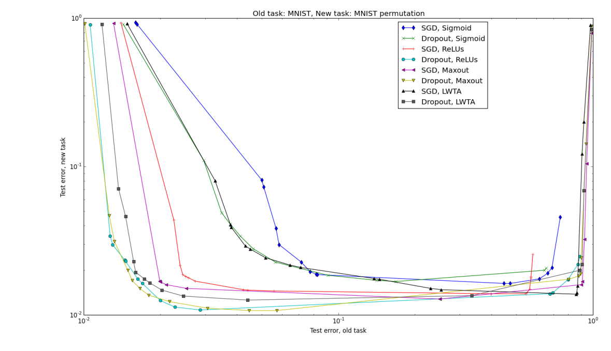</td><td>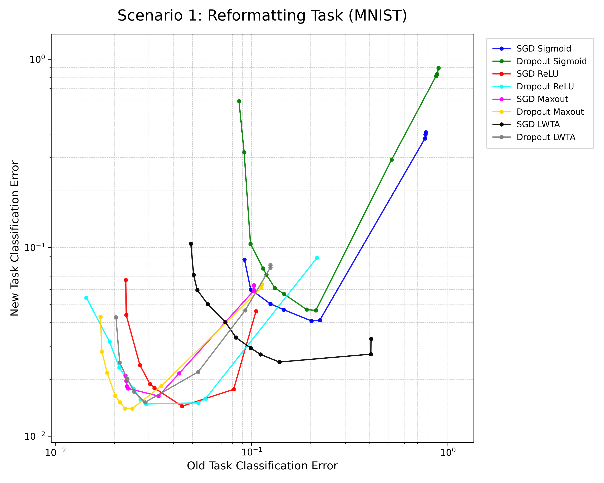</td></tr></table>

**Figure 2 — Model Sizes, Input Reformatting**
<table><tr><th>Original (Paper)</th><th>Ours (Reproduced)</th></tr>
<tr><td>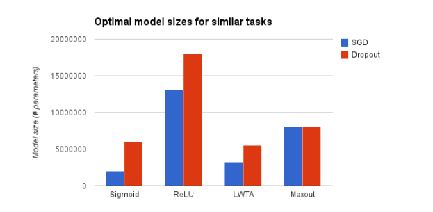</td><td>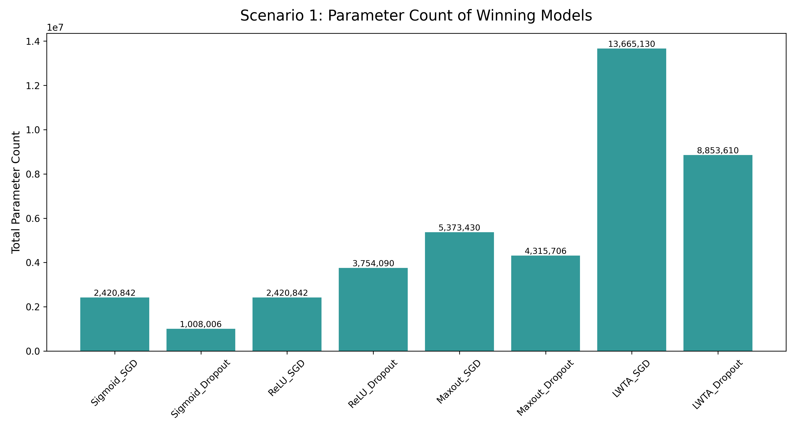</td></tr></table>

**Figure 3 — Frontier, Similar Tasks**
<table><tr><th>Original (Paper)</th><th>Ours (Reproduced)</th></tr>
<tr><td>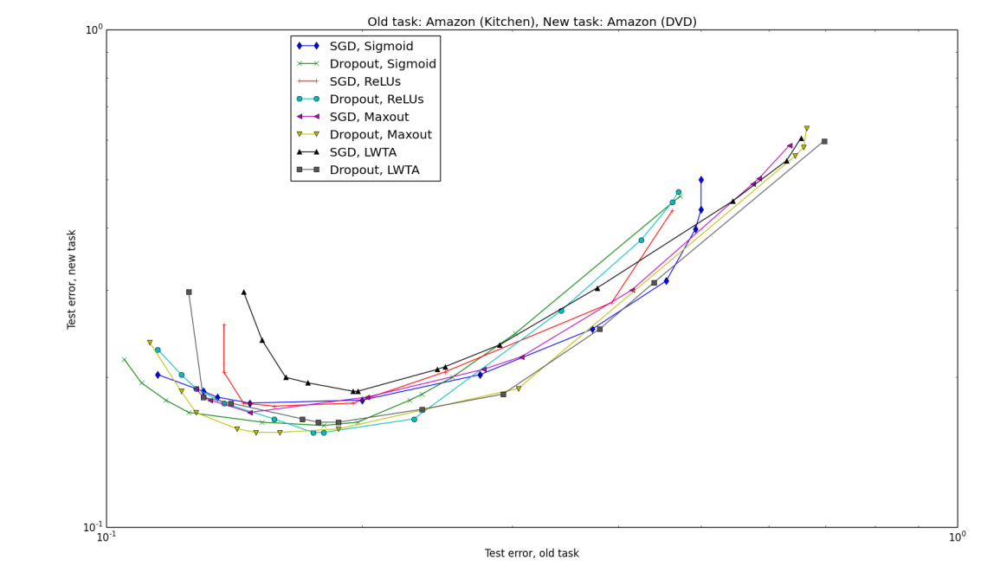</td><td>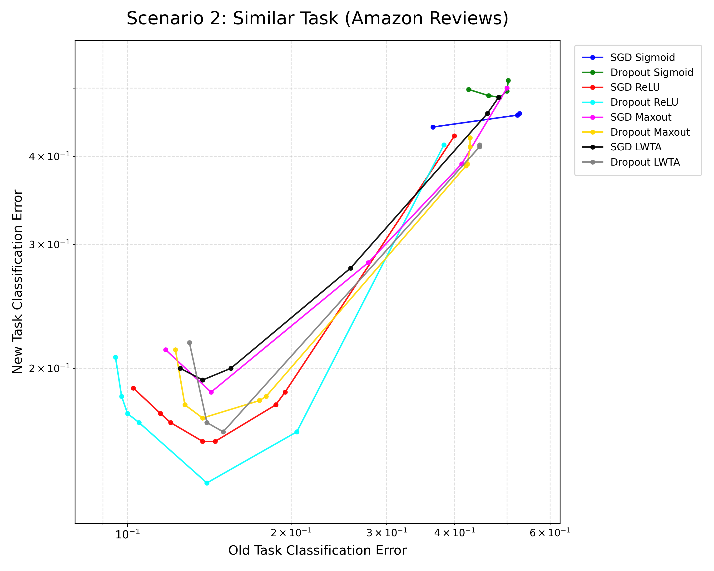</td></tr></table>

**Figure 4 — Model Sizes, Similar Tasks**
<table><tr><th>Original (Paper)</th><th>Ours (Reproduced)</th></tr>
<tr><td>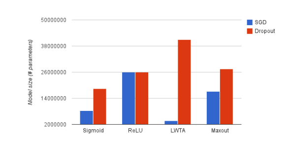</td><td>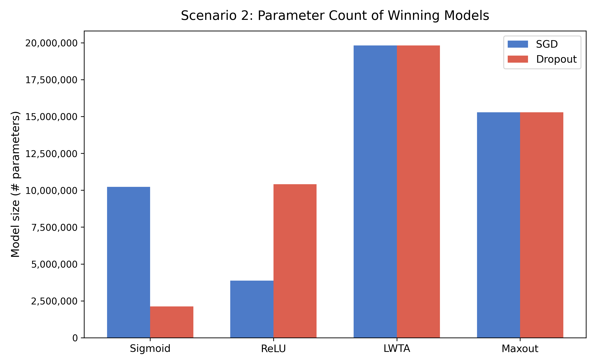</td></tr></table>

**Figure 5 — Frontier, Dissimilar Tasks**
<table><tr><th>Original (Paper)</th><th>Ours (Reproduced)</th></tr>
<tr><td>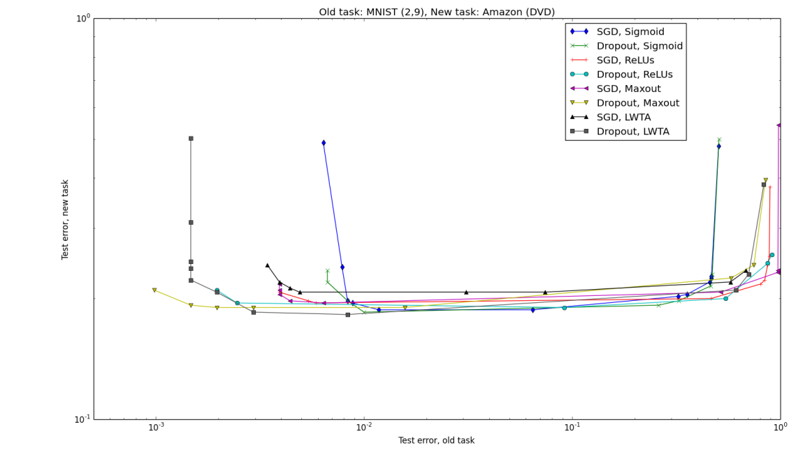</td><td>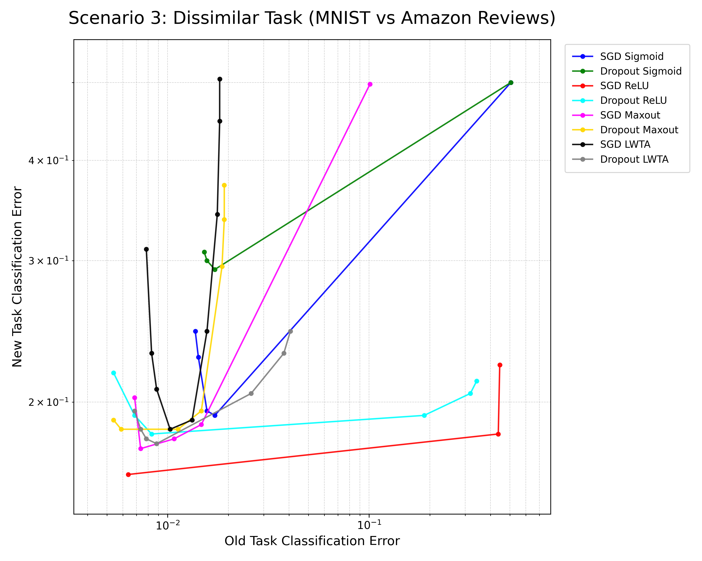</td></tr></table>

**Figure 6 — Model Sizes, Dissimilar Tasks**
<table><tr><th>Original (Paper)</th><th>Ours (Reproduced)</th></tr>
<tr><td>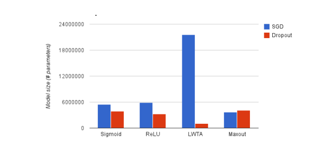</td><td>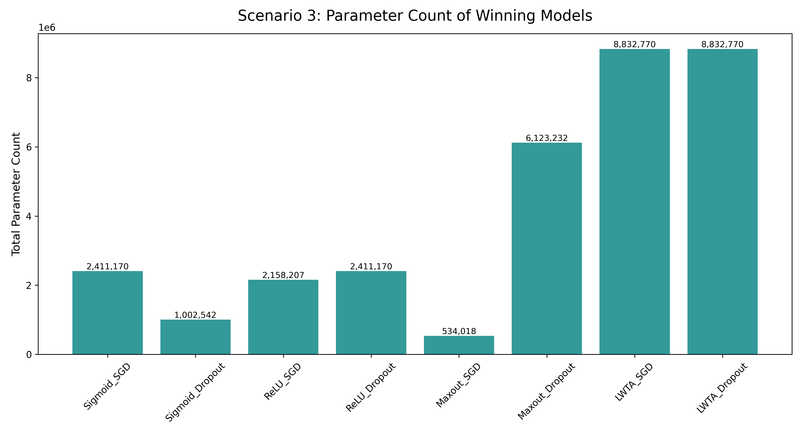</td></tr></table>

---

## Ablation Study — Bonus Extension

> **Bonus:** This section goes beyond the original paper and is submitted as an improvement under the criterion **"Proposing an alternative approach to data analysis"** — instead of comparing only final results, the ablation isolates *why* Dropout works by varying one component at a time in a controlled setup.

Beyond reproduction, we ran controlled ablation experiments to isolate the mechanisms behind Dropout's forgetting resistance. Key results:

| Component | Forgetting Rate | Reduction vs Baseline |
|---|---|---|
| No Dropout | 0.0287 ± 0.0098 | — |
| Dropout p=0.2 | 0.0244 ± 0.0129 | -15% |
| Dropout p=0.5 | **0.0129 ± 0.0205** | **-55%** |
| Weight Decay 1e-4 | 0.0067 ± 0.0036 | marginal |

Dropout is the dominant mechanism for forgetting resistance (−55% at p=0.5). Weight decay shows negligible additional benefit. See [docs/ablation.md](docs/ablation.md) for full analysis.
