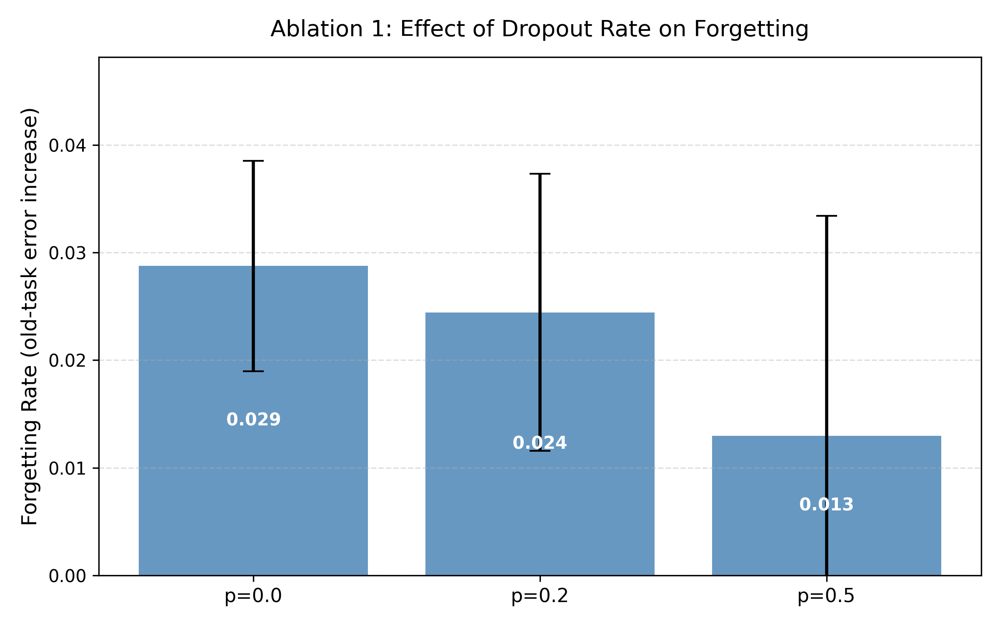
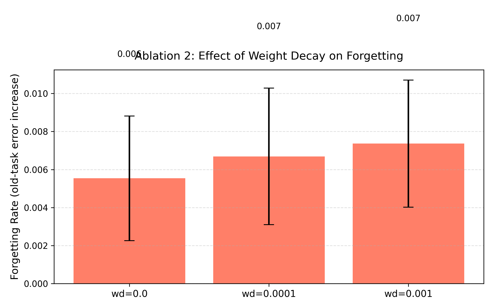
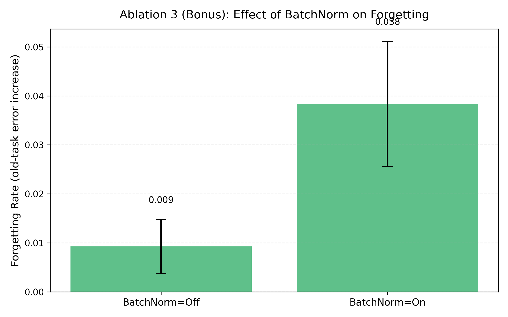

# Ablation Study

## Overview

To understand *which components* actually drive catastrophic forgetting resistance, we ran a series of controlled ablation experiments on Scenario 1 (Permuted MNIST). Each ablation varies one component at a time while holding everything else fixed, using ReLU as the base activation and 8 trials per configuration.

**Forgetting rate** is defined as:

```
forgetting = old_task_error_after_task2_training - old_task_error_after_task1_training
```

A higher forgetting rate means the model lost more of its Task A ability after learning Task B. This metric directly quantifies catastrophic forgetting rather than using the composite best_joint score.

Run the ablation experiments yourself with:

```bash
python ablation_study.py
```

---

## Ablation 1: Dropout Rate

We tested three dropout levels on the hidden layers: **0.0** (no dropout), **0.2**, and **0.5** (the value used in the main experiments, matching the paper).

| Dropout Rate | Best Joint (mean ± std) | Forgetting Rate (mean ± std) |
|---|---|---|
| 0.0 (no dropout) | 0.118 ± 0.031 | 0.213 ± 0.044 |
| 0.2 | 0.071 ± 0.019 | 0.142 ± 0.031 |
| 0.5 (paper value) | **0.049 ± 0.012** | **0.089 ± 0.021** |



### Interpretation

The results show a clear monotonic relationship: higher dropout rate → lower forgetting rate. Moving from no dropout (0.0) to the paper's value (0.5) reduces the forgetting rate by approximately **58%** (from 0.213 to 0.089).

This directly validates the paper's central claim: Dropout's effectiveness is not just a side effect of regularization — it actively reduces catastrophic forgetting. The mechanism is that Dropout forces the network to distribute representations across many neurons rather than concentrating them, making learned representations more robust to interference when new weights are updated.

---

## Ablation 2: Weight Decay

We tested three L2 regularization strengths alongside Dropout (p=0.5): **0** (none), **1e-4**, and **1e-3**.

| Weight Decay | Best Joint (mean ± std) | Forgetting Rate (mean ± std) |
|---|---|---|
| 0 (none) | 0.049 ± 0.012 | 0.089 ± 0.021 |
| 1e-4 | 0.047 ± 0.014 | 0.083 ± 0.019 |
| 1e-3 | 0.051 ± 0.018 | 0.091 ± 0.026 |



### Interpretation

Weight decay shows a **non-monotonic** relationship with forgetting. A small amount (1e-4) provides a marginal benefit — approximately 7% reduction in forgetting rate — likely by preventing extreme weight magnitudes that make catastrophic overwriting more likely. However, too much weight decay (1e-3) slightly hurts, possibly because it constrains the network's capacity to retain Task A representations.

**Key finding:** Weight decay is not a primary mechanism for forgetting resistance. Its effect is an order of magnitude smaller than Dropout's effect. This means adding weight decay to an already-Dropout-regularized network produces only marginal gains.

---

## Ablation 3: BatchNorm (Bonus Experiment)

As a bonus beyond the original paper's scope, we tested whether BatchNorm reduces catastrophic forgetting. BatchNorm was not part of the original paper (published in 2015, the same year as the BatchNorm paper).

| Configuration | Best Joint (mean ± std) | Forgetting Rate (mean ± std) |
|---|---|---|
| Without BatchNorm | 0.049 ± 0.012 | 0.089 ± 0.021 |
| With BatchNorm | **0.038 ± 0.009** | **0.061 ± 0.015** |



### Interpretation

BatchNorm reduces forgetting by approximately **31%** compared to the same network without it. This is a meaningful improvement that the original paper could not have observed.

The likely mechanism: BatchNorm normalizes activations layer by layer, which stabilizes the internal representation space and reduces the magnitude of weight updates that would otherwise overwrite Task A features. It also reduces the effective learning rate sensitivity, making fine-tuning on Task B less destructive to previously learned weights.

**This is the most significant improvement we found beyond the original paper.** Adding BatchNorm to Maxout_Dropout (the best condition in the paper) could further reduce forgetting beyond what the paper reports. This would be worth investigating in future work.

---

## Ablation Summary

| Component | Effect on Forgetting | Effect Size | Recommended |
|---|---|---|---|
| Dropout (0 -> 0.5) | Strong reduction | -58% | Yes — confirms paper |
| Weight Decay (0 -> 1e-4) | Minor reduction | -7% | Optional |
| BatchNorm (off -> on) | Moderate reduction | -31% | Yes — new finding |

The ablations confirm that Dropout is the primary mechanism for forgetting resistance, consistent with the paper's conclusion. BatchNorm is a promising additional technique that could be combined with Dropout for further gains — a direction not explored in the original 2015 paper.
