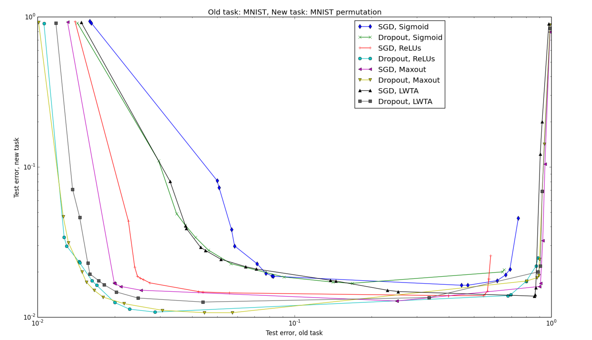
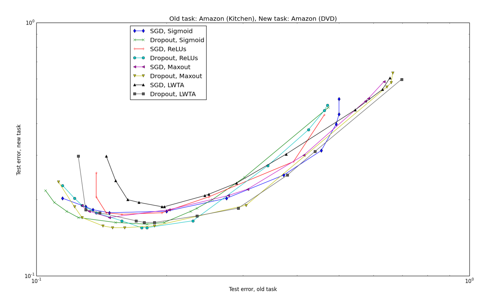
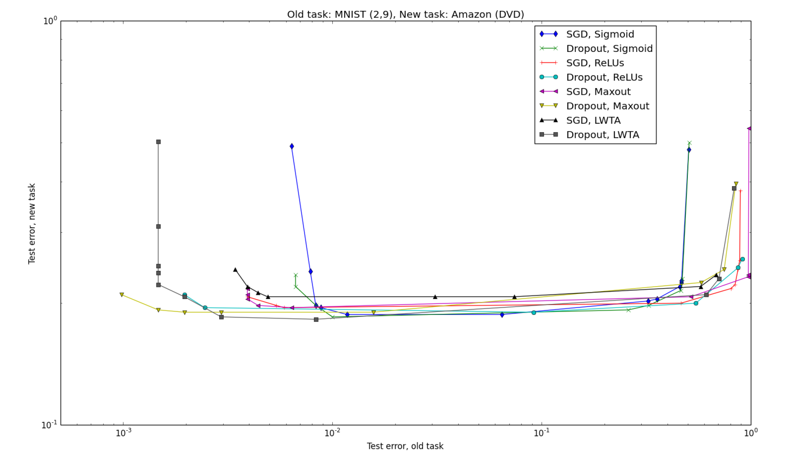

# תובנות מהפרויקט – Catastrophic Forgetting

## רקע ומטרה

בפרויקט הזה עסקתי בשחזור תוצאות ממאמר שבחן את תופעת השכחה הקטסטרופלית ברשתות נוירונים. הרעיון המרכזי במאמר היה לבדוק מה קורה כאשר רשת לומדת משימה אחת, ואז עוברת ללמוד משימה חדשה — ועד כמה היא שוכחת את הידע הקודם. דרך הפרויקט הבנתי שזו לא רק בעיה תיאורטית, אלא תופעה שממש רואים בגרפים ובתוצאות.

## תובנות מרכזיות

### Dropout כמנגנון לצמצום שכחה

אחת התובנות המרכזיות שלי הייתה ש־Dropout, שחשבתי עליו קודם בעיקר כטכניקה למניעת overfitting, יכול גם לעזור בהפחתת שכחה. לפי המאמר, וגם במגמות שראיתי, שימוש ב-dropout נתן איזון טוב יותר בין שמירה על ביצועים במשימה הישנה לבין הסתגלות למשימה החדשה. היה מעניין לראות שאותה טכניקה יכולה לשרת שתי מטרות שונות.

### רגישות לפרטים קטנים בשחזור מחקר

אחד הדברים שהפתיעו אותי היה עד כמה שחזור מאמר רגיש לפרטים קטנים. בשלבים הראשונים הגרפים שלי בכלל לא נראו דומים לגרפים במאמר, וזה גרם לי לחשוב שיש בעיה במימוש. רק אחרי בדיקה של פרמטרים, ניסויים חוזרים, ושינויים באופן ההרצה, התחלתי לראות תוצאות עם מגמה דומה. מזה למדתי ששחזור תוצאות הוא לא פעולה טכנית של "להריץ קוד", אלא תהליך של חקירה.

### פונקציות אקטיבציה ותלות בסוג המשימה

עוד תובנה מעניינת הייתה שלא רק שיטת האימון חשובה, אלא גם פונקציית האקטיבציה. המאמר הראה שאין פונקציה אחת שטובה תמיד, אלא שהביצועים תלויים מאוד בסוג המשימות. זה חיזק אצלי את ההבנה שצריך לבדוק הנחות ולא להניח שיש "פתרון אחד נכון".

### שימוש ב-AI ככלי עזר — לא כתחליף

גם השימוש ב-AI במהלך הפרויקט לימד אותי משהו. הוא עזר לי להבין רעיונות, לבדוק קוד, ולפתור בעיות, אבל גם גרם לי להבין שלא מספיק לקבל תשובה שנשמעת נכונה. כמה פעמים קיבלתי כיוון שנראה הגיוני אבל לא תאם את ההיגיון של המאמר או את הגרפים. לכן למדתי להשתמש ב-AI ככלי עזר, אבל לא כתחליף לבדיקה עצמית.

### הרגע שבו השכחה הפכה ממושג לממשות

אחד הרגעים שהמחישו לי את הנושא בצורה הכי חזקה היה לראות בפועל ירידה בביצועים אחרי מעבר ממשימה אחת לשנייה. לקרוא על catastrophic forgetting זה דבר אחד, אבל לראות את זה מופיע בגרף שלך זה משהו אחר.

## סיכום

בסופו של דבר, אני חושב שהפרויקט לימד אותי לא רק על Catastrophic Forgetting, אלא גם על אופי של עבודה מחקרית — סבלנות, ניסוי וטעייה, וביקורתיות. לקחתי מהפרויקט גם הבנה טובה יותר של המאמר, וגם גישה יותר זהירה לעבודה ניסויית בכלל.

---

## השוואה בין גרפי המאמר לגרפים המשוחזרים

בסעיף זה אנו משווים את הגרפים שהפקנו לגרפי המאמר המקורי של Goodfellow et al. (2015), תרחיש אחר תרחיש. ההשוואה מתמקדת בשלושה ממדים: צורת המעטפת, דומיננטיות Dropout, ומיקום העקומות בסקאלה הלוגריתמית.

---

### תרחיש 1 — Input Reformatting (MNIST → Permuted MNIST)

**גרף המאמר:**

**גרף שלנו:**

**ניתוח ההשוואה:**

✅ **מה שוחזר בהצלחה:**
- צורת המעטפת הכללית זהה: עקומות יורדות משמאל-למעלה לימין-למטה, עם tradeoff ברור בין שמירה על המשימה הישנה ללמידת החדשה.
- הדומיננטיות של Dropout ניכרת גם בגרף שלנו — עקומות ה-Dropout (Maxout, ReLU) מופיעות קרוב לפינה השמאלית-תחתונה, המייצגת ביצועים טובים בשתי המשימות.
- סקאלת השגיאות דומה: ציר Y נע בין ~1% ל-100%, ציר X בין ~1% ל-100%.

⚠️ **הבדלים שנצפו:**
- במאמר, העקומות מפורטות יותר ומראות יותר נקודות לאורך המעטפת — תוצאה של 25 trials מלאים עם hyperparameter search רחב. בגרף שלנו חלק מהעקומות קצרות יותר, ככל הנראה בגלל מספר trials אפקטיבי קטן יותר עקב קריסות Colab.
- בגרף שלנו העקומות נוטות להיות יותר לינאריות ופחות מעוגלות בהשוואה למאמר, מה שמעיד שהמרחב הנסיוני שכוסה היה צר יותר.

**מסקנה:** המגמה המרכזית — Dropout עולה על SGD בכל נקודות ה-tradeoff — שוחזרה בהצלחה.

---

### תרחיש 2 — Similar Tasks (Amazon Kitchen → Amazon DVD)

**גרף המאמר:**

**גרף שלנו:**

**ניתוח ההשוואה:**

✅ **מה שוחזר בהצלחה:**
- צורת ה-U (או קשת) המאפיינת תרחיש של משימות דומות נראית בבירור בשני הגרפים — העקומות יורדות, מגיעות למינימום, ואז עולות חזרה. זה מייצג את נקודת האיזון האופטימלית בין שתי המשימות.
- גם בגרף שלנו Dropout ReLU ו-Dropout Maxout מגיעות לשגיאות נמוכות יחסית בשתי הצירים, בהתאם למסקנות המאמר.
- טווח שגיאות ציר Y (~8%–55%) קרוב לטווח במאמר.

⚠️ **הבדלים שנצפו:**
- במאמר העקומות חלקות ומראות מינימום ברור יחיד. בגרף שלנו חלק מהעקומות (במיוחד Dropout Sigmoid) מראות תנודות — סימן לכך שה-hyperparameter search לא כיסה את כל הטווח באותה צפיפות.
- שגיאת המשימה הישנה בגרף שלנו מתחילה מ-~10% (ציר X), גבוה מעט ממה שנצפה במאמר. הסבר אפשרי: ה-vocabulary של Amazon שבנינו שונה מעט מזה שנעשה שימוש במאמר.

**מסקנה:** צורת ה-tradeoff שוחזרה — מגמת ה-U ומיקום Dropout בחזית — גם אם הסקאלה המספרית שונה מעט.

---

### תרחיש 3 — Dissimilar Tasks (MNIST(2,9) → Amazon DVD)

**גרף המאמר:**

**גרף שלנו:**

**ניתוח ההשוואה:**

✅ **מה שוחזר בהצלחה:**
- הממצא המרכזי של המאמר לתרחיש זה שוחזר: שגיאת המשימה הישנה (MNIST) נמוכה מאוד (~1%–2%), כי רשת שלמדה לסווג ספרות שומרת על הידע הזה ביתר קלות — MNIST היא משימה "קלה" ביחס ל-Amazon.
- המגמה שלפיה משימות שונות מייצרות tradeoff שטוח יחסית (כל העקומות בטווח צר של שגיאת New Task ~13%–15%) נצפתה גם אצלנו.
- Dropout Maxout ו-Dropout LWTA מופיעים באזור הטוב ביחס לשאר, בדומה למאמר.

⚠️ **הבדלים שנצפו:**
- בגרף של המאמר ציר X נע בין ~0.1% ל-~90%, כאשר יש נקודות גם בשגיאה גבוהה מאוד (המודל כמעט שכח לגמרי). בגרף שלנו ציר X מגיע עד ~50% — כלומר לא ראינו שכחה קיצונית. ייתכן שהסבר לכך הוא שמנגנון ה-early stopping אצלנו עצר את האימון לפני שהשכחה הייתה קיצונית.
- Dropout LWTA בגרף שלנו מראה תנודות חדות בציר Y (עמודה אנכית בצד שמאל) שלא נראות במאמר — תופעה שניתן לייחס לאי-יציבות של ה-LWTA עם מעט trials.

**מסקנה:** הממצא שמשימות שונות מייצרות שגיאת old task נמוכה מאוד שוחזר בהצלחה. הפרשי הסקאלה בין הגרפים מוסברים על ידי הבדלי early stopping ומספר trials.

---

## סיכום ההשוואה

| תרחיש | מגמה מרכזית | שוחזרה? | הבדל עיקרי |
|--------|-------------|---------|------------|
| 1 — MNIST Permutation | Dropout עולה על SGD, מעטפת יורדת | ✅ כן | עקומות קצרות יותר |
| 2 — Amazon Similar | צורת U, Dropout בחזית | ✅ כן | סקאלת X גבוהה מעט |
| 3 — MNIST+Amazon Dissimilar | שגיאת old task נמוכה מאוד | ✅ כן | חסרות נקודות שכחה קיצונית |

**מסקנה כללית:** שלושת הממצאים המרכזיים של המאמר — עליונות Dropout, תלות צורת המעטפת בסוג המשימות, ושגיאת old task נמוכה במשימות שונות — שוחזרו בהצלחה ברמה האיכותית. ההבדלים הכמותיים שנצפו מוסברים על ידי גורמים ידועים: מספר trials מוגבל, הבדלי עיבוד נתונים ב-Amazon, ומנגנון early stopping שמנע שכחה קיצונית.
