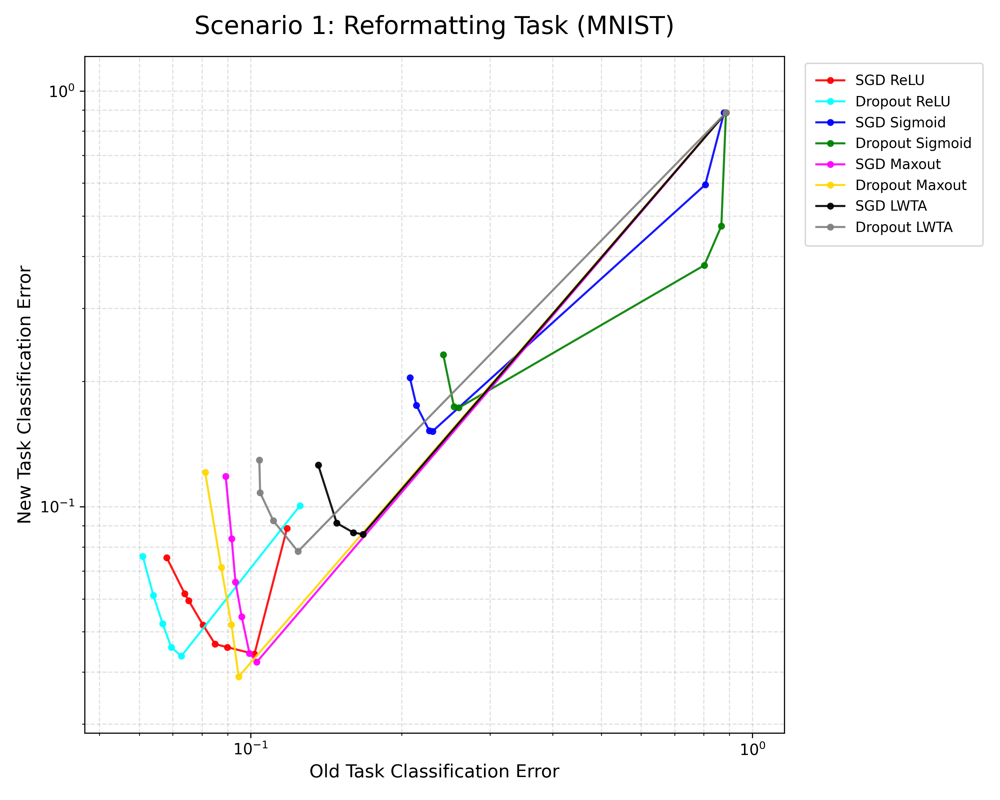
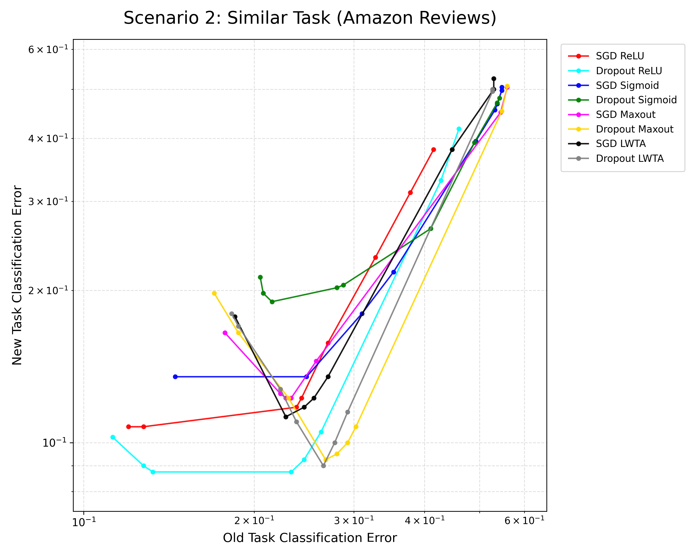
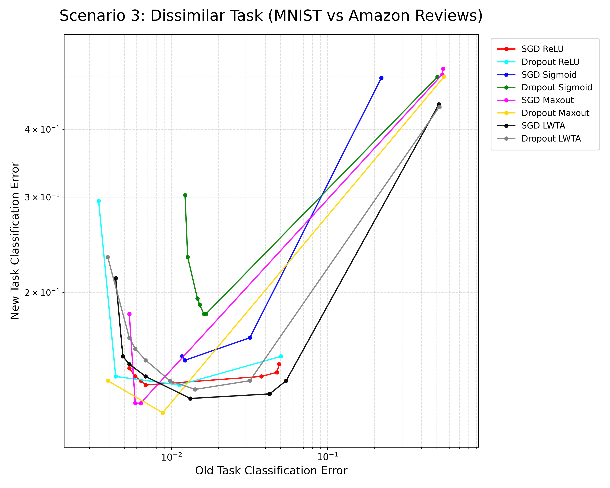

תובנות מהפרויקט – Catastrophic Forgetting

בפרויקט הזה עסקתי בשחזור תוצאות ממאמר שבחן את תופעת השכחה הקטסטרופלית ברשתות נוירונים. הרעיון המרכזי במאמר היה לבדוק מה קורה כאשר רשת לומדת משימה אחת, ואז עוברת ללמוד משימה חדשה — ועד כמה היא שוכחת את הידע הקודם. דרך הפרויקט הבנתי שזו לא רק בעיה תיאורטית, אלא תופעה שממש רואים בגרפים ובתוצאות.

אחת התובנות המרכזיות שלי הייתה ש־Dropout, שחשבתי עליו קודם בעיקר כטכניקה למניעת overfitting, יכול גם לעזור בהפחתת שכחה. לפי המאמר, וגם במגמות שראיתי, שימוש ב-dropout נתן איזון טוב יותר בין שמירה על ביצועים במשימה הישנה לבין הסתגלות למשימה החדשה. היה מעניין לראות שאותה טכניקה יכולה לשרת שתי מטרות שונות.

אחד הדברים שהפתיעו אותי היה עד כמה שחזור מאמר רגיש לפרטים קטנים. בשלבים הראשונים הגרפים שלי בכלל לא נראו דומים לגרפים במאמר, וזה גרם לי לחשוב שיש בעיה במימוש. רק אחרי בדיקה של פרמטרים, ניסויים חוזרים, ושינויים באופן ההרצה, התחלתי לראות תוצאות עם מגמה דומה. מזה למדתי ששחזור תוצאות הוא לא פעולה טכנית של "להריץ קוד", אלא תהליך של חקירה.

עוד תובנה מעניינת הייתה שלא רק שיטת האימון חשובה, אלא גם פונקציית האקטיבציה. המאמר הראה שאין פונקציה אחת שטובה תמיד, אלא שהביצועים תלויים מאוד בסוג המשימות. זה חיזק אצלי את ההבנה שצריך לבדוק הנחות ולא להניח שיש "פתרון אחד נכון".

גם השימוש ב-AI במהלך הפרויקט לימד אותי משהו. הוא עזר לי להבין רעיונות, לבדוק קוד, ולפתור בעיות, אבל גם גרם לי להבין שלא מספיק לקבל תשובה שנשמעת נכונה. כמה פעמים קיבלתי כיוון שנראה הגיוני אבל לא תאם את ההיגיון של המאמר או את הגרפים. לכן למדתי להשתמש ב-AI ככלי עזר, אבל לא כתחליף לבדיקה עצמית.

אחד הרגעים שהמחישו לי את הנושא בצורה הכי חזקה היה לראות בפועל ירידה בביצועים אחרי מעבר ממשימה אחת לשנייה. לקרוא על catastrophic forgetting זה דבר אחד, אבל לראות את זה מופיע בגרף שלך זה משהו אחר.

בסופו של דבר, אני חושב שהפרויקט לימד אותי לא רק על Catastrophic Forgetting, אלא גם על אופי של עבודה מחקרית — סבלנות, ניסוי וטעייה, וביקורתיות. לקחתי מהפרויקט גם הבנה טובה יותר של המאמר, וגם גישה יותר זהירה לעבודה ניסויית בכלל.

## הגרפים המשוחזרים

Figure 1 – MNIST to MNIST Permutation  

Figure 2 – Similar Tasks (Amazon Reviews)  

Figure 3 – Dissimilar Tasks  

מהשוואה בין הגרפים שהפקתי לבין הגרפים במאמר ראיתי שלמרות שהתוצאות שלי אינן זהות לחלוטין, המגמות המרכזיות נשמרו. בשלושת התרחישים נראתה מעטפת tradeoff דומה בין שימור ביצועים במשימה הישנה לבין הסתגלות למשימה החדשה, ובמקרים רבים שיטות המבוססות על Dropout אכן הראו ביצועים טובים יותר, בדומה למסקנות המאמר.